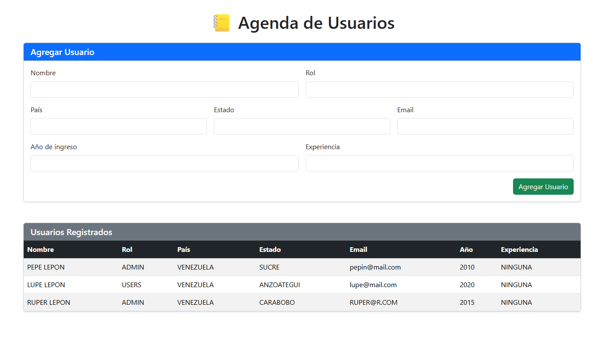

# Agenda de Usuarios - Spring Boot + Thymeleaf + Bootstrap

📒 Proyecto de ejemplo que permite gestionar una agenda de usuarios almacenada en un archivo JSON.  
El proyecto está desarrollado con **Spring Boot 3**, **Thymeleaf** y **Bootstrap 5** para la interfaz web.

---


## Características

- Mostrar todos los usuarios registrados en un archivo JSON.
- Agregar nuevos usuarios a la agenda mediante un formulario web.
- Interfaz responsiva y moderna usando Bootstrap.
- Datos persistentes en `usuario.json`.


## Tecnologías
- Java 24
- Spring Boot 3.5.x
- Thymeleaf 3
- Bootstrap 5
- Jackson (para lectura/escritura de JSON)

---
## 📷 Captura de pantalla



## Estructura del Proyecto
```text
agenda-json/
│
├─ src/main/java/com/anamuc/jsonReader/
│ ├─ AgendaJsonApplication.java # Clase principal de Spring Boot
│ └─ AgendaController.java # Controlador que maneja la lógica de usuarios
│
├─ src/main/resources/templates/
│ └─ index.html # Plantilla Thymeleaf con Bootstrap
│
├─ src/main/resources/static/
│ └─ (opcional: archivos CSS/JS adicionales)
│
├─ usuario.json # Archivo JSON con los usuarios
├─ pom.xml # Dependencias Maven
└─ README.md
```

---

## Cómo ejecutar el proyecto
```text
Clone el proyecto
cd agenda-json
mvn clean install
mvn spring-boot:run
http://localhost:8080/
```
 # Uso
Completar el formulario Agregar Usuario y hacer clic en "Agregar Usuario".
Ver los usuarios registrados en la tabla debajo del formulario.
Todos los datos se guardan en usuario.json.
# Nota
El proyecto no requiere base de datos, todos los datos se almacenan en un JSON local.
Se puede mejorar añadiendo validaciones, eliminación de usuarios y edición de registros.

###  
[](https://www.linkedin.com/in/moleculax) [](https://www.instagram.com/moleculax)   []() []()  [](https://www.debian.org/) [](https://hub.docker.com/u/moleculax)


 “Cada sistema tiene errores. Cada error, una historia. Cada historia, una evolución.”
###
